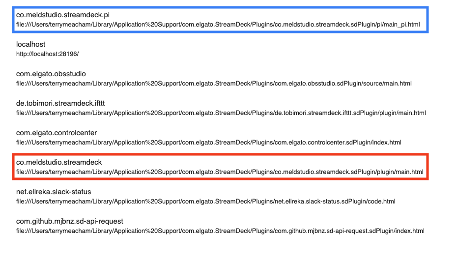
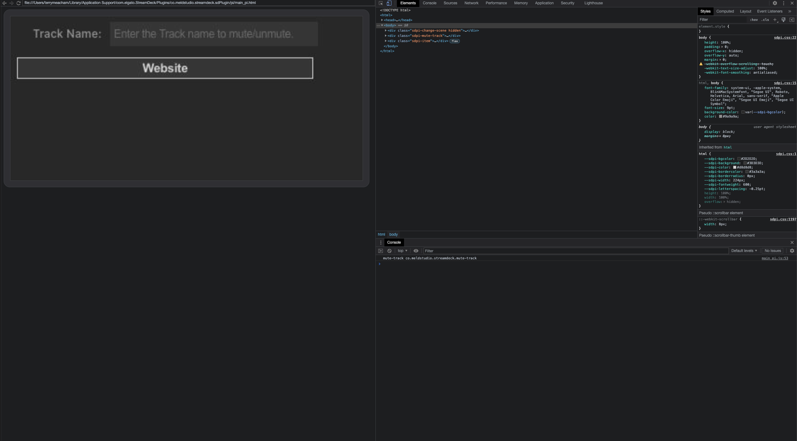

# Meld Studio - Stream Deck Plugin

To download the current official release, visit our page on the [Elgato marketplace](https://marketplace.elgato.com/product/meld-studio-737415fa-1957-489d-a62e-1becec068b6e).

## Integrations

If you're interested in developing a software intergration with Meld Studio, you can find our API documentation [here](./WebChannelAPI.md). If you have any questions, please join our [discord](https://discord.gg/ZHpeXEw4) and reach out in [`#support`](https://discord.com/channels/1019227275897614337/1019584582913364101).

## Development

We primarily develop on macOS, so these instructions are tailored to macOS. Feel free to submit a PR to update them for Windows if that's your flavor of OS.

1) Check out the repository.
2) Run `scripts/install.sh` (optionally, `--fresh` to remove and reinstall).

   This will update the plugin in `~/Library/Application\ Support/com.elgato.StreamDeck/Plugins/` if it exists.

3) Code away.
4) Run `scripts/install.sh` again to update the install.

   See below for debugging information.

## Debugging:

1. To enable debugging on macOS, run: `defaults write com.elgato.StreamDeck html_remote_debugging_enabled -bool YES` and restart Stream Deck app.
2. Navigation to `http://localhost:23654/` in Chrome.
3. Click on one of the two entries:



* The blue link shows the Property Inspector page and console log.
* The red link shows the CodePath button press page and console.

Which should yield you:



From here you can refresh the plugin source from the debug console UI.

For more details: https://streamdecklabs.com/debugging-your-javascript-plugin/

## Packaging

Elgato provides a CLI packaging tool.

[https://docs.elgato.com/sdk/plugins/packaging]

```
$ npm -g install @elgato/cli
$ streamdeck validate co.meldstudio.streamdeck.sdPlugin
$ streamdeck pack co.meldstudio.streamdeck.sdPlugin
```

This outputs a file `co.meldstudio.streamdeck.streamDeckPlugin` which can be installed directly.
